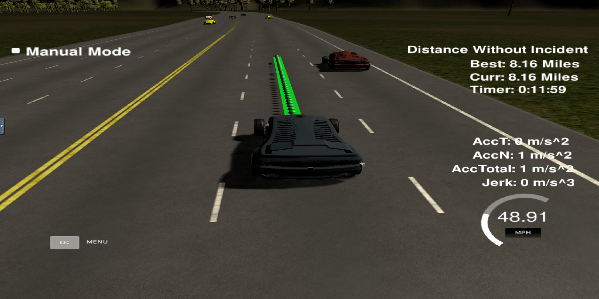

# 项目概述

本项目来源于 Udacity 自动驾驶课程中的**路径规划项目**。通过简单的简单的算法，实现车辆在高速公路上按限速（50MPH）自主行驶，并能在前方车辆较慢时能自主刹车，和前车保持安全距离，必要时候能够实现变道。同时需要在减速、变道和加速时保证车辆行驶轨迹可行且满足行驶舒适的要求。其中道路信息（`/data/highway_map.csv`）、定位数据和对周边车辆的感知融合的数据（由模拟器提供）已由课程项目提供。

## 道路信息

其中道路信息包含 `[x,y,s,dx,dy]`，分别表示在地图中的 x， y 坐标，距离道路起始点的 Frenet 坐标 s。（dx 和 dy 为单位向量，无需使用）

## 车辆信息

定位和感知融合数据均为关于车辆的信息，其中包含：

* ["x"] 车辆在地图坐标系中的 x 坐标；
* ["y"] 车辆在地图坐标系中的 y 坐标；
* ["s"] 车辆位置在 Frenet 坐标系中的 s 坐标（沿道路前进方向）；
* ["d"] 车辆位置在 Frenet 坐标系中的 d 坐标（左右方向）；
* ["yaw"] 车辆在地图坐标系下的转向角；
* ["speed"] 车速（MPH）。

## 项目准备

完成项目需要准备：

* 模拟器：可以点击[这里](https://github.com/udacity/self-driving-car-sim/releases/tag/T3_v1.2)下载
* 开发环境：因程序通过 uWebsocket 与模拟器相连，uWebsocket 需要Linux下运行，因此需要在 Linux 系统中运行项目，可下载Udacity提供的[虚拟机](https://s3-us-west-1.amazonaws.com/udacity-selfdrivingcar/Udacity_VM_Base_V1.0.0.zip)，或自行安装其他虚拟机并运行 Ubuntu 系统

> 注意，如使用虚拟机，需要注意设置端口转发，模拟器和虚拟机的配置可参考同样来自于Udacity自动驾驶课程中的 Capstone 项目，可点击[这里](https://github.com/XiaojianTang/Udacity-Selfdriving-Capstone-Project)跳转至该项目仓库。

# 项目主结构

本项目的程序主要包含了以下三个部分：

* 预测 Prediction
* 行为规划 Behavior Planning
* 轨迹生成 Trajectory Generation

## 预测模块 Prediction Module

本模块将**感知融合**的数据作为输入，输出三个布尔值的变量，分别是 `car_ahead, car_left, car_right` ，用来表示是否有车辆在本车前方、左方和右方。如本车前方一定范围内有车辆，则 `car_ahead = true`，当本车左边道路前后方一定范围内有车辆时 `car_left = true`，同样当本车右边道路前后方一定范围内有车辆时 `car_right = true`。具体步骤如下：

### 1. 计算他车车速

依次获取 `sensor_fusion `中其他车辆车辆的 `d, vx, vy, s` ，并通过 x，y 方向的速度的平方根计算车辆的行驶速度 `check_speed `;

```C++
float d = sensor_fusion[i][6];
int check_car_lane; 
double vx = sensor_fusion[i][3];
double vy = sensor_fusion[i][4];
check_speed = sqrt(vx*vx+vy*vy);
check_car_s = sensor_fusion[i][5];
check_car_s += ((double)prev_size*.02*check_speed); 
```

### 2. 计算他车所在车道

通过 sensor_fusion 数据中的 d 数据，计算车辆所在的车道，用变量 `check_car_lane `表示。

> 项目模拟器中的道路为双向六车道的环形道路。其中当 d = 0 时，表示在道路双向的分界线上。因此，当d为负时，表示车辆在反向车道上。在本车的行驶侧，第一条车道中线为 d = 2，第二条车道为 d = 4，最右侧车道为 d = 6

* 当 `d `为负时，车辆在反向车道上，不会对本车产生影响，无需考虑，可将 `check_car_lane `设为 `-99` ;
* 当 `d` 为正时，如在 `[0,4]` 之间，则 `check_car_lane = 1 `;
* 当 `d` 在 `[4,8]` 之间，则 `check_car_lane = 2` ;
* 当 `d` 在 `[8,12]` 之间，则 `check_car_lane  =3` ;

参考代码如下：

```C++
if(d>0 && d<4 ){
    check_car_lane = 0;}

else if(d>4 && d<8){
    check_car_lane = 1;}

else if(d>8){
    check_car_lane = 2;}
   
else{
    check_car_lane = -99;}
```

### 3. 判断是否有前车

如果其他车辆所在车道 `check_car_lane `与本车车道 `lane `相同，且距离本车距离 ` check_car_s - car_s` 少于 30（可根据测试效果调整） ，且车速 `check_speed `小于本车速度 `car_speed `时（可根据测试效果调整），则将 `car_ahead `设为 `true`。此变量可作为是否需要变道的起始触发条件。

> 如在有限状态机 Limit State Machine 中可以理解为，此时应切换为变道预备状态 prepare_to_change

```C++
if (check_car_lane == lane){
    if(check_car_s>car_s && check_car_s-car_s<30 && check_speed<car_speed){
        car_ahead = true; } }
```

### 4. 判断左右车道是否有车

当判断前方有车辆且车速较低时，此时应该考虑变道。而变道之前，应考虑左右车道是否有空隙可进行变道，如在距离本车前后 50 米的范围存在车辆时，则将 `car_left `或 `car_right `设为 true， 表示此时有车辆占据了左右车道，不宜变道。

```C++
else if (check_car_lane - lane == -1){
    if(check_car_s>car_s-50 && check_car_s<car_s+50){
        car_left = true; } }

else if (check_car_lane - lane == 1){  
    if(check_car_s>car_s-50 && check_car_s<car_s+50){
        car_right = true; } } 
```

> 需要注意的是，因之前已将逆向车辆所在车道 check_car_lane 设为了 -99，因此，逆向车道上的车辆并不会产生干扰

### 5. 他车轨迹的预测补充说明

本模块虽称为**预测**模块，但是因为项目场景相对简单，多数时间其他车辆都在各自车道上匀速行驶，因此并没有通过车辆的历史状态去预测其轨迹。只需要对车辆的车速和所在车道进行了感知，并假设其轨迹就是沿车道线即可。

## 行为规划 Behavior Planning Module

本模块通过数个 `if...` 条件语句实现。

首先根据 `car_ahead `判断前方是否有车距较近（`check_car_s - car_s < 30`）且车速较慢（`check_speed < car_speed`）的车辆（详见预测模块）。如 `car_ahead `为 `true`，则车辆应该进入**预备变道的阶段**，此时在根据左右车道的情况，进行行为规划，具体如下：

### 1. 本车在左道

* 如本车在车道 0 （ `lane == 0`，既左侧车道），此时车辆无法向左变道，因此需对右侧车道是否有车进行检测（ `car_right` ），如不为 true 则可向右变道 ( `lane = lane + 1` )：

```C++
if(lane == 0 && car_right == false){ lane = lane + 1; }
```

### 2. 本车在右道

* 如本车在车道 2 （ `lane == 2`，既右侧车道），此时车辆无法向右变道，因此需对左侧车道是否有车进行检测（ `car_left` ），如不为 true 则可向右变道 ( `lane = lane - 1` )：

```C++
else if(lane == 2 && car_left == false){ lane = lane - 1; }
```

### 3. 本车在中间道

* 如本车在车道 1 （ `lane == 1`，既中间车道），此时车辆可向左或向右变道，按驾驶习惯，一般左侧为超车道，因此优先对左侧车道是否有车进行检测（ `car_left` ），如不为 true 则可向左变道 ( `lane = lane - 1` )：

```C++
else if(lane == 1 && car_left == false){ lane = lane - 1; }
```

* 同样当本车在车道 1 （ `lane == 1`，既中间车道），上面左侧道（ `car_left` ）有车辆占道（既 `car_left == true` )，则继续检测右侧车道是否有车（`car_right`)，如不为 true 则可向右变道 ( `lane = lane + 1` )：

```C++
else if(lane == 1 && car_right == false){ lane = lane + 1; }
```

### 4. 无法变道

* 最后当以上所有条件全部未能达成，则说明此时车辆无法完成变道，则需将目标车速 `ref_vel `减低以保持行车安全。为了避免急减速带来的不舒适，减速的幅度设置为 `speed_diff `：

```C++
else { ref_vel = ref_vel - speed_diff; }   
```

### 5. 保持或加速至最高车速

另外，当 `car_ahead `为 `false `时，则表明前方没有车辆（或刚完成变道），此时应让目标车速 `ref_vel` 逐渐加速至最大限速 `max_speed`：

```C++
if(car_ahead == true){
    ...}

else if(ref_vel < max_speed){
    ref_vel = ref_vel + speed_diff; }
```

### 6. 本车行为规划补充说明

本项目为简化后的场景，条件相对简单，因此并没有用到

* 有限状态机 Limit State Vector ，及
* 成本方程 Cost Function，

来进行行为规划。

如需改进，可以增加有限的状态，如 `keep_lane, change_lane_left, change_lane_right, prep_change_lane_left, prep_change_lane_right` 等五个状态。Cost Function 也可以根据车辆所在车道，做出相应的转化成本，如车辆已在左道则向左变道的成本为无穷大、一般情况下向左变道的成本高于向右变道、保持较低车速的成本高于变道等等。

## 轨迹生成模块 Trajectory Generation Module

本项目使用 `spline `库来生成轨迹。`spline `库的导入（点击[这里](https://kluge.in-chemnitz.de/opensource/spline/)下载），只需下载 `spline.h` 文件，并在主程序中增加 ` #include "spline.h"` 即可。

> spline 译为样条曲线，本质是多项式 polynomial，能更简单的生成光顺的路径

### 1. 生成参考路径点

可以把路径点（`ptsx,ptsy`）理解为生成 spline 的控制点，而路径点可由 Frenet 坐标迅速找到。

* 获得路径点frenet坐标 `s`：可以在车辆当前位置（`car_s`）的前30米（`car_s + 30`）、60米（`car_s + 60`）、90米（`car_s + 90`）处各设一个路径点；
* 获得路径点frenet坐标 `d` ：`d `值应对应行为规划模块中所计算得到的目标车道 `lane`。因一条车道宽 4m，因此需将 lane 值进行转换，既 `d = 2+4*lane` ；
* 通过 getXY 函数，将路径点的 `[s, d]`获取各个路径点的地图坐标 `[x，y]`，并加入 `ptsx, ptsy`

```C++
//add some points to generate spline  
vector<double> next_wp0 = getXY(car_s + 30, 2 + 4*lane, map_waypoints_s, map_waypoints_x, map_waypoints_y);
vector<double> next_wp1 = getXY(car_s + 60, 2 + 4*lane, map_waypoints_s, map_waypoints_x, map_waypoints_y);
vector<double> next_wp2 = getXY(car_s + 90, 2 + 4*lane, map_waypoints_s, map_waypoints_x, map_waypoints_y);
  
ptsx.push_back(next_wp0[0]);
ptsx.push_back(next_wp1[0]);
ptsx.push_back(next_wp2[0]);
ptsy.push_back(next_wp0[1]);
ptsy.push_back(next_wp1[1]);
ptsy.push_back(next_wp2[1]);
```

### 2. 车辆坐标转换

为了简化数学，可以将参考路径点从地图坐标系转化到车辆坐标系下，使 x 轴为车辆前进方向，y 轴为车辆左右方向：

```C++
//transform points to car coordiante  
for ( int i = 0; i < ptsx.size(); i++ ) {  
    double shift_x = ptsx[i] - ref_x;
    double shift_y = ptsy[i] - ref_y;
    ptsx[i] = shift_x * cos(0 - ref_yaw) - shift_y * sin(0 - ref_yaw);
    ptsy[i] = shift_x * sin(0 - ref_yaw) + shift_y * cos(0 - ref_yaw);
          }
```

> 车辆的前进方向可通过之前的路径的最后两个点求得，既从倒数第二点指向倒数第一点的向量的方向为 车辆前进的方向 `ref_yaw`

### 3. 生成 spline

将转化为车辆坐标系下的路径点 `ptsx, ptsy` 输入给 spline 后，便可以生成样条线：

```C++
//creat a spline;
tk::spline s;
  
//add points to spline
s.set_points(ptsx, ptsy);
```

### 4. 生成路径点

在获得了参考的spline后，则可以在spline中提取近30米的一段，来生成路径点（项目中路径点定义为每 2 毫秒一个），各变量关系如下图：


其中，

* 目标点的 x 坐标（车辆坐标系）为 `target_x`，定义成30即可；
* 目标点的 y 坐标（车辆坐标系）为 `target_y`，通过spline s可获得，既 target_y = s(target_x) ；
* `target_dist `为现在位置和目标点之间的距离；
* 因在行为规划模块中已经计算了车速限制 `ref_vel`，且每一个路径点之间间隔为 2 毫秒，因此每一点之间的间隔为 `0.02*ref_vel/2.24` (时间默认单位为秒，另需将速度转化为英里制);
* 这个路径中总共有 N 个控制点 `N = target_dist/(0.02*ref_vel/2.24)` 。
* 最后，仍需要将车辆坐标下的路径点转化为地图坐标下

参考代码如下：

```C++
//get target points(end points) from spline s  
double target_x = 30.0;
double target_y = s(target_x);
double target_dist = sqrt(target_x*target_x + target_y*target_y);
  
double x_add_on = 0;
  
for( int i = 1; i < 50 - prev_size; i++ ) {
    double N = target_dist/(0.02*ref_vel/2.24);
    double x_point = x_add_on + target_x/N;
    double y_point = s(x_point);
  
    x_add_on = x_point;
  
    double x_ref = x_point;
    double y_ref = y_point;
  
    //transform from car coordinate to map coordinate  
    x_point = x_ref * cos(ref_yaw) - y_ref * sin(ref_yaw);
    y_point = x_ref * sin(ref_yaw) + y_ref * cos(ref_yaw);
  
    x_point += ref_x;
    y_point += ref_y;
    next_x_vals.push_back(x_point);
    next_y_vals.push_back(y_point);} 
```

最终，`next_x_vals `及 `next_y_vals `既为所需要的路径点

### 5. 轨迹生成补充说明

为了使车辆运动时的**加速度 acceleration** 和**加加速度 jerk** 能控制在一定范围内，一般使用5次的多项式 polinomial 来生成路径，本项目直接使用 spline 样条线则更加方便快捷。

最后在模拟器中运行效果如下图，绿色小球为规划生成的路径点：


